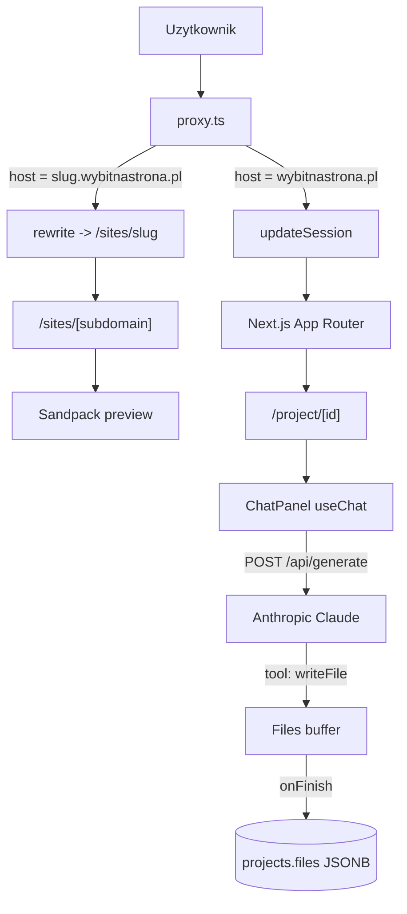

# wybitnastrona.pl - AI Website Builder

Kreator stron wybitnastrona.pl - AI Website Builder w paletcie czerni i beżu, z polskim UI. Stack:

- **Next.js 16** (App Router, Turbopack, **`proxy.ts`** - rewrite subdomen + nagłówki COOP/COEP)
- **Tailwind CSS v4** + **shadcn/ui** + **Lucide**
- **Supabase** (`@supabase/ssr`) - auth (email/hasło + Google) + persistencja projektów
- **Anthropic Claude** (Sonnet) - generowanie kodu przez tool calls (`writeFile`, `deleteFile`)
- **Sandpack** (`@codesandbox/sandpack-react`) - sandbox z live preview w bezpiecznym iframe
- Subdomeny `<slug>.wybitnastrona.pl` - publish jednym klikiem

## Funkcje

- Hero wybitnastrona.pl + sugestie startowe
- Generator AI w `/project/[id]` (split view: chat + Sandpack code/preview)
- Dashboard z listą projektów
- Publish na subdomenę przez `proxy.ts` (rewrite do `/sites/[slug]`)
- Eksport projektu jako ZIP (Vite + React)
- Public share `/p/[slug]` z przyciskiem Remix
- Showcase, How it works, FAQ, Pricing
- SEO: `sitemap.ts`, `robots.ts`, dynamiczne `opengraph-image.tsx`
- RODO: cookie banner + strony prywatności i regulamin

## Szybki start

### 1. Instalacja

```bash
npm install
```

### 2. Supabase

1. Utwórz projekt na [supabase.com](https://supabase.com).
2. Skopiuj `.env.local.example` do `.env.local` i wypełnij `NEXT_PUBLIC_SUPABASE_URL` + `NEXT_PUBLIC_SUPABASE_ANON_KEY`.
3. Zaaplikuj migrację:

   - **Opcja A (CLI)**: `supabase db push` (jeśli używasz Supabase CLI)
   - **Opcja B (Dashboard)**: skopiuj zawartość [`supabase/migrations/0001_projects.sql`](supabase/migrations/0001_projects.sql) do SQL Editor i uruchom
   - **Opcja C (MCP w Cursor)**: agent automatycznie zaaplikuje przez `apply_migration`

4. W **Authentication → URL Configuration** ustaw:
   - Site URL: `http://localhost:3000`
   - Redirect URL: `http://localhost:3000/auth/callback`

5. (Opcjonalnie) Włącz Google OAuth w **Authentication → Providers → Google** - instrukcja: [supabase.com/docs/guides/auth/social-login/auth-google](https://supabase.com/docs/guides/auth/social-login/auth-google).

### 3. Anthropic API key

1. Utwórz klucz na [console.anthropic.com](https://console.anthropic.com/).
2. Dodaj do `.env.local`: `ANTHROPIC_API_KEY=sk-ant-...`.

### 4. Zmienne aplikacji

```bash
NEXT_PUBLIC_APP_URL=http://localhost:3000
NEXT_PUBLIC_ROOT_DOMAIN=localhost:3000
```

W produkcji ustaw `https://wybitnastrona.pl` oraz `wybitnastrona.pl`.

### 5. Uruchomienie

```bash
npm run dev
```

[http://localhost:3000](http://localhost:3000).

## Subdomeny - jak to działa

`proxy.ts` w katalogu głównym sprawdza nagłówek `Host`. Jeśli pasuje do wzorca `<slug>.<NEXT_PUBLIC_ROOT_DOMAIN>` lub domena własna z tabeli `projects`, robi `NextResponse.rewrite` do `/sites/<slug>`. W przeciwnym wypadku odświeża sesję Supabase.

### Dev

`<slug>.localhost:3000` działa od razu w nowoczesnych przeglądarkach (Chrome, Firefox, Edge) bez konfiguracji `/etc/hosts`. Spróbuj: opublikuj projekt, skopiuj link i wklej.

### Produkcja (Vercel)

1. W panelu Vercel → Settings → Domains dodaj `wybitnastrona.pl` jako primary i `*.wybitnastrona.pl` jako wildcard.
2. W DNS dodaj rekord `CNAME *` wskazujący na `cname.vercel-dns.com`.
3. Vercel automatycznie obsłuży SSL dla wildcard.

## Struktura projektu

```
project/
├── app/
│   ├── api/
│   │   ├── generate/route.ts             # Anthropic streaming + tool calls
│   │   └── projects/[id]/
│   │       ├── route.ts                   # PATCH (title), DELETE
│   │       ├── publish/route.ts           # POST/DELETE publish
│   │       └── export/route.ts            # GET zip
│   ├── auth/                              # callback + error
│   ├── dashboard/page.tsx                 # lista projektów
│   ├── legal/{privacy,terms}/page.tsx
│   ├── p/[slug]/page.tsx                  # publiczny share
│   ├── pricing/page.tsx
│   ├── project/
│   │   ├── new/page.tsx                   # tworzy rekord + redirect
│   │   └── [id]/page.tsx                  # split view
│   ├── sites/[subdomain]/                 # subdomain rewrite target
│   │   ├── layout.tsx
│   │   ├── page.tsx
│   │   └── not-found.tsx
│   ├── globals.css
│   ├── layout.tsx
│   ├── opengraph-image.tsx
│   ├── page.tsx                           # marketing landing
│   ├── robots.ts
│   └── sitemap.ts
│
├── components/
│   ├── auth/                              # provider, modal, forms
│   ├── landing/                           # showcase, how-it-works, faq, ...
│   ├── project/                           # workspace, chat-panel, topbar
│   ├── sandpack/                          # runner + inner (dynamic import)
│   ├── ui/                                # shadcn primitives
│   ├── cookie-banner.tsx
│   ├── footer.tsx
│   ├── hero.tsx
│   ├── navbar.tsx
│   ├── prompt-input.tsx
│   └── suggestion-grid.tsx
│
├── lib/
│   ├── sandpack/starter.ts                # pliki startowe Sandpack
│   ├── supabase/{client,server,proxy}.ts
│   ├── types/project.ts
│   ├── projects.ts                        # CRUD helpery (server-only)
│   └── utils.ts
│
├── supabase/migrations/0001_projects.sql
├── proxy.ts                               # subdomain / custom domain rewrite + nagłówki COOP/COEP
├── next.config.ts
└── .env.local.example
```

## Architektura



## Komendy

```bash
npm run dev           # development
npm run build         # production build
npm run start         # production server
npm run lint          # ESLint
```

## Następne kroki

- [ ] Stripe billing (Pro / Teams)
- [ ] Custom domains (CNAME pointing)
- [ ] Wersjonowanie / undo (snapshots files)
- [ ] WebContainers (terminal w przeglądarce, `npm install`)
- [ ] Real-time collaboration (Supabase Realtime)
- [ ] Generator OG dla każdego projektu
- [ ] Dopasować docs Supabase do aktualnej konwencji Next (`proxy.ts`)
