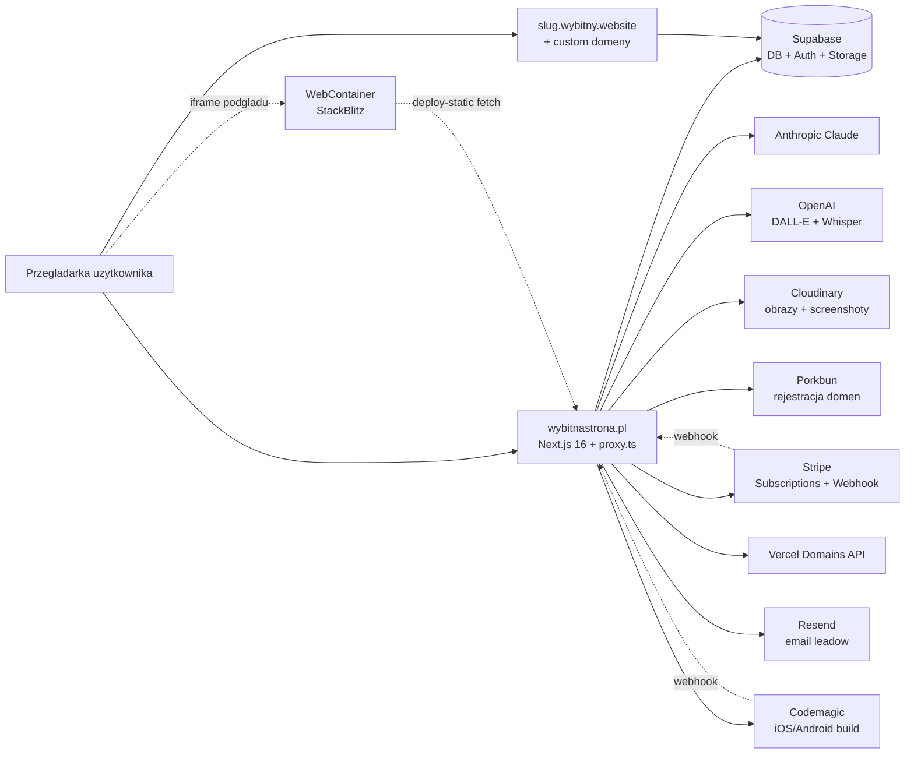
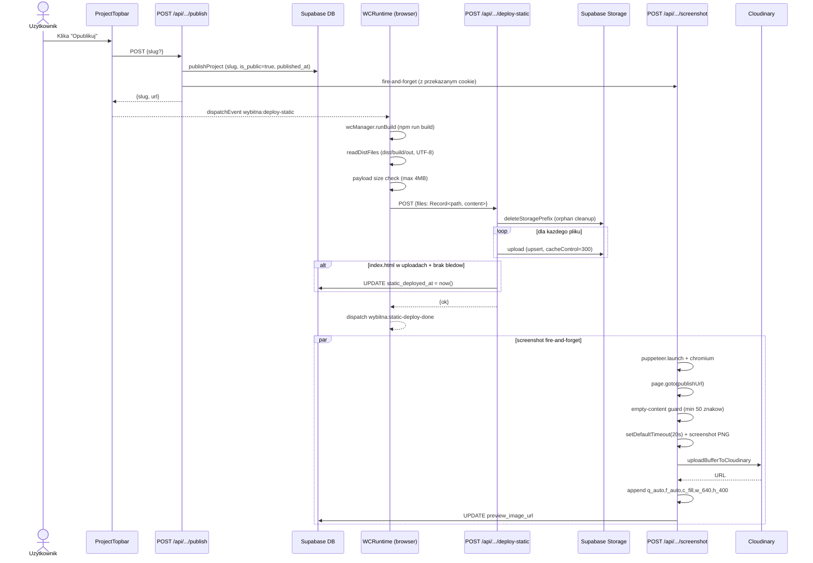
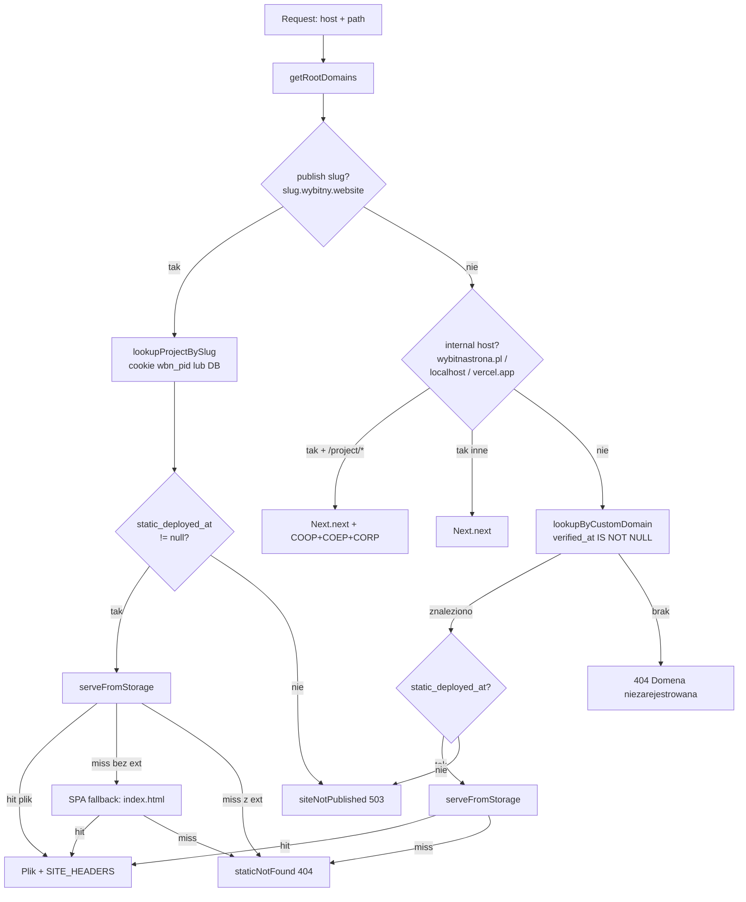
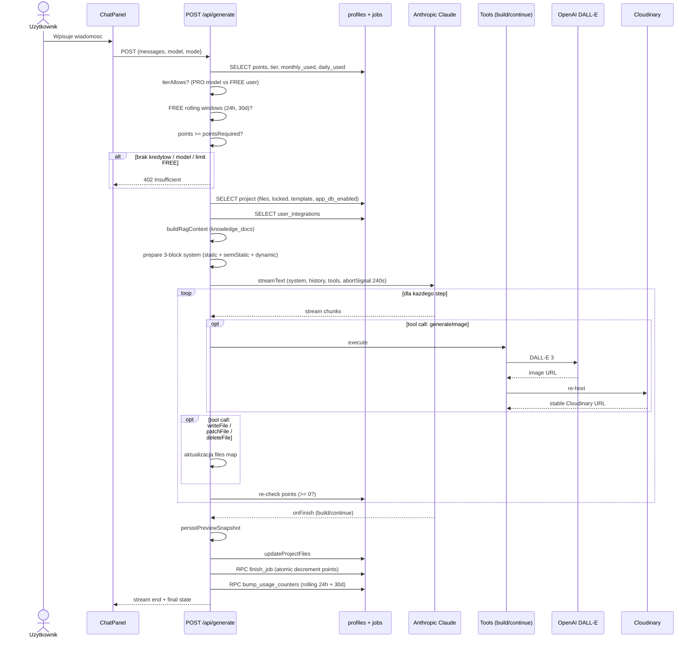

# Audyt infrastruktury — wybitnastrona.pl

Stan: maj 2026. Dokument odzwierciedla finalny stan po wszystkich migracjach 0001-0048 oraz "Platform Fixes + Advanced Panel Overhaul" i 100-punktowym hardeningu produkcyjnym.

---

## 1. TL;DR

**wybitnastrona.pl** to platforma typu "AI website builder" — użytkownik opisuje stronę, model AI (Claude) generuje kod React/Vite, użytkownik publikuje stronę pod subdomeną `slug.wybitny.website` lub własną domeną.

**Stack:** Next.js 16 App Router (Turbopack) + Supabase (DB + Auth + Storage) + Stripe (subskrypcje 8-poziomowe) + WebContainer (StackBlitz, podgląd w przeglądarce) + Sandpack (CodeSandbox, publiczny showcase) + Cloudinary (obrazy, screenshoty) + Anthropic Claude + OpenAI DALL-E.

**Publikacja statyczna:** WebContainer odpala `npm run build`, paczka `dist/` ląduje w publicznym buckecie Supabase Storage `deployed-sites/{projectId}/*`, a `proxy.ts` (edge middleware) serwuje pliki z bucketu pod subdomenami z poprawnymi nagłówkami COOP/COEP wymaganymi przez `crossOriginIsolated`. Dla projektów bez zbudowanego dist'a pokazujemy brandowaną stronę "w przygotowaniu" zamiast fallbacku do Sandpacka (CORS-friendly).

**Monetyzacja:** FREE tier z limitem 1500 kredytów / rolling 30 dni i 800 kredytów / 24h. PRO ma 8 poziomów (500-96000 kredytów, 39-2799 zł/mc). Każdy model AI ma fixed `pointCost`, każda generacja odejmuje kredyty atomowo przez RPC `finish_job` i podbija liczniki przez RPC `bump_usage_counters`.

---

## 2. System Context

Wysokopoziomowa mapa zależności zewnętrznych. Wszystkie strzałki to wywołania serwer-do-serwera z `app/api/**` lub odczyty/zapisy z klienta (w przypadku Supabase także bezpośrednio z przeglądarki przez SSR client).

---

## 3. Stack i warstwy aplikacji

| Warstwa | Technologia | Kluczowe pliki |
|---------|-------------|----------------|
| Frontend SSR | Next.js 16 App Router (Turbopack) | `app/**/page.tsx`, `app/layout.tsx` |
| Styling | Tailwind + shadcn/ui + OKLCH | `components/ui/**`, `app/globals.css` |
| Auth client | `@supabase/ssr` (cookies w SSR + browser client) | `lib/supabase/server.ts`, `lib/supabase/browser.ts` |
| Auth provider | React context z `onAuthStateChange` | `components/auth/auth-provider.tsx` |
| AI integration | Vercel AI SDK + `@ai-sdk/anthropic` + tools | `app/api/generate/route.ts`, `lib/ai-models.ts`, `lib/ai-prompts.ts` |
| Code preview | **WebContainer** (edytor) + **Sandpack** (showcase) | `components/webcontainer/wc-runtime.tsx`, `components/project/sandpack-inner.tsx` |
| Static deployment | Supabase Storage public bucket + edge proxy | `app/api/projects/[id]/deploy-static/route.ts`, `proxy.ts` |
| Screenshots | Puppeteer + `@sparticuz/chromium` + Cloudinary | `app/api/projects/[id]/screenshot/route.ts` |
| Payments | Stripe Subscriptions API + webhook | `app/api/stripe/*/route.ts`, `lib/stripe-products.ts` |
| Domeny | Porkbun (rejestracja) + Vercel Domains (attach) + Cloudflare DoH (DNS verify) | `lib/porkbun.ts`, `lib/vercel.ts`, `app/api/projects/[id]/domain/verify/route.ts` |
| Rate limiting | In-memory bucket per IP/user | `lib/rate-limit.ts` |
| Email | Resend HTTP API | `app/api/form-submit/route.ts` |

---

## 4. Frontend — mapa stron i workspace'ów

### 4.1 Strony (App Router)

Wszystkie strony są **server components** z wyjątkiem `app/onboarding/page.tsx` (`"use client"`). Strony serwerowe renderują klientowe drzewa pod spodem.

| URL | Opis | Główne UI |
|-----|------|-----------|
| `/` | Home — różny widok dla zalogowanego/gościa | Zalogowany: `AppShell` + `CreationHero`. Gość: `Navbar` + `Hero` + landing sections + `Footer` |
| `/dashboard` | Lista projektów (osobno od `AppShell`) | `Navbar` + `DashboardGrid` |
| `/onboarding` | Kwestionariusz profilu po pierwszej rejestracji | własny formularz client-side |
| `/project/new` | Tworzenie projektu z query params | `createProject` → redirect do `/project/[id]` |
| `/project/[id]` | Edytor AI — główny workspace | `ProjectWorkspace` (topbar + chat + canvas) |
| `/project/[id]/analytics` | Legacy redirect → `?settings=analytics` | redirect |
| `/project/[id]/variants` | Warianty A/B/C promptu | `VariantsClient` + `SandpackRunner` |
| `/p/[slug]` | Publiczna showcase | `Navbar` + `SandpackRunner` + `RemixButton` |
| `/sites/[subdomain]` | Wewnętrzny podgląd subdomeny (legacy, używane przy fallbackach) | `SandpackRunner` + `MadeWithBadge` |
| `/r/[code]` | Referral attribution | cookie `wybitna_ref` → redirect `/` |
| `/docs`, `/help-faq` | Dokumentacja i FAQ | sekcje statyczne |
| `/templates` | Biblioteka promptów | `TemplatesGrid` |
| `/pricing` | Cennik (PRO + FREE) | `PricingClient` |
| `/billing/success` | Powrót ze Stripe Checkout | komunikat sukcesu |
| `/legal/privacy`, `/legal/terms` | Legal pages | artykuły statyczne |
| `/auth/error` | Strona błędu OAuth/email confirm | `ResendConfirmationForm` |

### 4.2 Layout główny

`app/layout.tsx` ładuje globalnie:
- Fonty Geist
- `metadata` i `viewport`
- Providery: `AuthProvider` → `SettingsProvider`
- `CookieBanner`, `PwaRegister`, Vercel `Analytics`

**Brak globalnego `Toaster`** — komunikaty są lokalne per komponent.

### 4.3 Workspace projektu

`components/project/project-workspace.tsx` to klientowy kontener z układem:

- **`ProjectTopbar`** — slug, opublikuj, integracje, ustawienia, switcher projektu
- **`WizardPanel`** — overlay z pytaniami startowymi (jeśli projekt świeży)
- **`ChatPanel`** — chat z asystentem, plan/build/discuss/continue mode, `BuyCreditsDialog` wpięty lokalnie
- **`WorkspaceCanvas`** — kontener przełączający widoki: Preview (WebContainer iframe), Code (Monaco), Database, Stripe, Snapshots, Assets, Analytics

### 4.4 Sandpack vs WebContainer — kiedy który

| Kontekst | Silnik | Powód |
|----------|--------|-------|
| `/project/[id]` z szablonem **web** (nie `codeOnly`) | **WebContainer** | Pełny Node.js w przeglądarce, dev server, `npm install`, `npm run build` |
| `/project/[id]` z szablonem **code-only** (iOS/Android) | Brak podglądu | `WorkspaceCodeEditor` + baner — kod natywny nie ma podglądu w browser |
| `/project/[id]/variants` | **Sandpack** | 3 niezależne podglądy obok siebie — Sandpack lekko startuje |
| `/p/[slug]`, `/sites/[subdomain]` | **Sandpack** | Publiczny showcase bez sesji właściciela |
| **`slug.wybitny.website` po publikacji** | **Statyczne pliki z Supabase Storage** | Trwała, szybka publikacja niezależna od Sandpacka i WebContainera |

---

## 5. Backend / API — kompletny rejestr

**Wszystkie route'y aktywne** (mają wywołania z `components/**` lub z zewnątrz). Pełna ścieżka URL względem hosta aplikacji.

### 5.1 AI / generowanie kodu

| URL | Opis | Klient | Runtime | Limit |
|-----|------|--------|---------|-------|
| `POST /api/generate` | Strumieniowe generowanie kodu (chat) z narzędziami | `chat-panel.tsx` | nodejs, **300s** | — |
| `POST /api/enhance-prompt` | "Ulepsz prompt" przed generowaniem | `cloud-tab.tsx` | nodejs, 30s | **12/min/user** |
| `POST /api/generate/variants` | 3 warianty kodu z różną temperaturą | `variants-client.tsx` | nodejs, 120s | — |
| `POST /api/generate/variants/accept` | Zapis wybranego wariantu | `variants-client.tsx` | nodejs | — |
| `POST /api/questionnaire` | 3 pytania startowe z opisu projektu | `wizard-panel.tsx` | nodejs, 30s | — |
| `POST /api/transcribe` | Whisper: audio → tekst | `voice-button.tsx` | nodejs, 60s | — |
| `GET/POST/DELETE /api/knowledge` | Knowledge base + embeddings (RAG) | `knowledge-tab.tsx` | nodejs, 60s | — |

### 5.2 Projekty (CRUD + publikacja)

| URL | Opis | Klient |
|-----|------|--------|
| `POST /api/projects` | Nowy projekt z szablonu/promptu | `templates-grid.tsx`, `creation-hero.tsx` |
| `GET /api/projects/list` | Lista projektów użytkownika | `project-switcher.tsx` |
| `GET /api/projects/check-slug` | Walidacja kolizji sluga | `project-topbar.tsx` |
| `POST /api/projects/remix` | Klon publicznego projektu | `remix-button.tsx` |
| `PATCH /api/projects/[id]` | Zmiana tytułu | `project-settings-dialog.tsx` |
| `DELETE /api/projects/[id]` | Usuwa projekt + odpina domenę z Vercel | `project-settings-dialog.tsx` |
| `POST /api/projects/[id]/publish` | Publikacja (slug, `is_public=true`) + fire-and-forget screenshot | `project-topbar.tsx` |
| `DELETE /api/projects/[id]/publish` | Cofnięcie publikacji + cleanup Storage | `project-topbar.tsx` |
| `POST /api/projects/[id]/deploy-static` | Upload `dist/` do Supabase Storage | `wc-runtime.tsx` |
| `DELETE /api/projects/[id]/deploy-static` | Cleanup bucketu | wewnętrzne (z `publish DELETE`) |
| `POST /api/projects/[id]/screenshot` | Puppeteer + Cloudinary upload | fire-and-forget z `publish` |
| `GET /api/projects/[id]/security-audit` | Audyt RLS przez `get_rls_audit()` | `security-audit-panel.tsx` |
| `PATCH /api/projects/[id]/files` | Zapis ręcznie edytowanych plików | `workspace-code-editor.tsx` |
| `GET/PUT /api/projects/[id]/messages` | Historia czatu | `chat-panel.tsx` |
| `GET /api/projects/[id]/snapshots` + `[snapshotId]` + `restore` | Snapshoty plików | `snapshot-panel.tsx` |
| `POST /api/projects/[id]/inline-edit` | Zamiana tekstu inline bez AI | `workspace-canvas.tsx` |
| `GET/PATCH /api/projects/[id]/context` | Custom system context | `project-topbar.tsx` |
| `GET /api/projects/[id]/stats` | Wykresy analityki | `analytics-dashboard.tsx` |
| `PUT /api/projects/[id]/database` | Zapis URL+key zewnętrznej Supabase | `database-panel.tsx` |
| `POST/DELETE /api/projects/[id]/activate-database` | Włącz/wyłącz Wybitną Bazę | `database-panel.tsx` |
| `POST /api/projects/[id]/generate-sql` | Propozycja SQL z kodu | `database-panel.tsx` |
| `GET /api/projects/[id]/form-submissions` | Lista zgłoszeń z formularzy | `form-submissions-panel.tsx` |
| `POST /api/projects/[id]/create-admin` | Tworzy admina (shared/external) | `form-submissions-panel.tsx` |
| `GET/PUT /api/projects/[id]/locked-files` | Locked files | `lock-files-dialog.tsx` |
| `GET /api/projects/[id]/app-users` | Użytkownicy aplikacji | `project-settings-dialog.tsx` |
| `PUT/DELETE /api/projects/[id]/domain` | Custom domena + Vercel attach | `project-topbar.tsx` |
| `POST /api/projects/[id]/domain/verify` | Weryfikacja DNS (Cloudflare DoH) | `project-topbar.tsx` |
| `GET/PUT /api/projects/[id]/stripe` | Stripe meta per projekt | `stripe-panel.tsx` |
| `GET /api/export/zip?projectId=` | ZIP eksport (PRO) | `project-topbar.tsx` |
| `POST /api/github/push` | Push do GitHub | `project-topbar.tsx` |

### 5.3 Domeny

| URL | Opis | Limit |
|-----|------|-------|
| `GET /api/domains/check?q=` | Dostępność + cena (Porkbun) | **10/min/user + 30/min/IP** |
| `POST /api/domains/register` | Rejestracja Porkbun + Vercel attach | — |

### 5.4 Stripe / billing

| URL | Opis |
|-----|------|
| `POST /api/stripe/checkout` | Session Checkout (sub) |
| `POST /api/stripe/webhook` | Webhook (subscription + invoice + connect) |
| `GET /api/integrations/stripe/connect` | OAuth Connect redirect |
| `GET /api/integrations/stripe/callback` | OAuth Connect callback |
| `GET/POST/DELETE /api/integrations/[provider]` | Per-provider config |
| `GET /api/referrals` | Kod polecenia + lista |

### 5.5 Forms / leads

| URL | Opis | Limit |
|-----|------|-------|
| `POST /api/form-submit?projectId=` | Zapis leada + Resend email | **5/min/IP+project** |
| `OPTIONS /api/form-submit` | CORS preflight z dynamic origin allowlist | — |

### 5.6 Auth / Me

| URL | Opis |
|-----|------|
| `GET /api/me/points` | Punkty + tier + cancel-at-period-end |

### 5.7 Submissions (iOS/Android)

| URL | Opis |
|-----|------|
| `GET/POST /api/submissions` | Lista + draft |
| `GET /api/submissions/[id]/status` | Status buildu |
| `POST /api/submissions/[id]/build` | Start buildu Codemagic |
| `POST /api/submissions/android` | Android + upload keystore |
| `POST /api/webhooks/codemagic` | Webhook Codemagic |

### 5.8 Cron

| URL | Opis | Auth |
|-----|------|------|
| `GET /api/cron/stale-jobs` | Oznaczanie "stuck" jobów | Bearer `CRON_SECRET` |

### 5.9 Martwe pliki (kandydaci do oczyszczenia)

Istnieją w `app/api/**` ale nikt z `components/**` lub `app/**` ich nie wywołuje:

- `POST /api/domains/buy`
- `GET /api/domains/search`
- `POST /api/stripe/upgrade`
- `POST /api/generate-image`
- `GET /api/projects/[id]/export`
- `PATCH /api/submissions`
- `POST /api/submissions/[id]/submit`
- `GET /api/projects/[id]/events`

---

## 6. Baza danych — schemat docelowy

### 6.1 Tabele platformowe (Supabase)

Stan po migracjach 0001-0048. Wszystkie z RLS chyba że zaznaczono inaczej.

| Tabela | Klucz | Kluczowe kolumny | Cel |
|--------|-------|------------------|-----|
| `profiles` | `id` → `auth.users` | `email`, `points`, `tier` (free/pro), `monthly_credits_used`, `monthly_credits_reset_at`, `daily_credits_used`, `daily_credits_reset_at`, `monthly_credits_limit`, `monthly_credit_quota`, `stripe_customer_id`, `stripe_subscription_*`, `stripe_cancel_at_period_end`, `referral_code` | Profil platformy + billing |
| `projects` | `id` | `user_id`, `slug`, `custom_slug_archived`, `title`, `prompt`, `files` (jsonb), `is_public`, `published_at`, `mode`, `template`, `custom_system_context`, `locked_files`, `custom_domain`, `custom_domain_verified_at`, `database_url`, `database_anon_key`, `app_db_enabled`, `static_deployed_at`, `preview_image_url` | Rdzeń systemu |
| `project_admins` | `(project_id, email)` UNIQUE | `password_hash`, `role` | "Light auth" dla wygenerowanych stron w trybie shared |
| `form_submissions` | `id` | `project_id`, `fields` (jsonb), `ip_address`, `user_agent`, `email_sent` | Leady z formularzy na opublikowanych stronach |
| `user_integrations` | `(user_id, provider)` | `config` (jsonb) | OAuth/MCP per user (`supabase`, `notion`, `stripe`, `memory`, `stitch`) |
| `generation_jobs` | `id` | `project_id`, `status`, `tokens`, `points_spent`, `is_continue` | Tracking generacji AI |
| `payments` | `id` | `user_id`, `stripe_payment_intent`, `points_added`, `status` | Historia płatności |
| `referrals` | `id` | `referrer_id`, `referred_id`, `bonus_credits` | Program poleceń |
| `stripe_events` | `event_id` PK | `type`, `received_at` | Idempotency dla webhooka (RLS OFF, dostęp tylko service role) |
| `knowledge_docs` | `id` | `user_id`, `content`, `embedding` (vector) | RAG knowledge base |
| `project_events` | `id` | `project_id`, `event_type`, `created_at` | Analytics |
| `user_integration_credentials` | `(user_id, provider)` | `credentials` (jsonb) | Sekrety ASC/Codemagic/Notion |
| `app_users` | `id` | `project_id`, `email` | Userzy aplikacji wygenerowanej (zewn. side) |

**Uwagi:**
- `project_domains` jako tabela **nie istnieje** — custom domain mieszka w `projects.custom_domain` + `projects.custom_domain_verified_at`. Komentarz w `app/api/form-submit/route.ts` wzmiankuje nieistniejącą tabelę.
- `app_form_submissions` wzmiankowane w kodzie ale **brak migracji** — leady zapisują się do `form_submissions`.

### 6.2 Shared App DB (osobna instancja Supabase)

Schemat dla "Wybitnej Bazy" — wspólnej instancji którą udostępniamy projektom bez własnej zewn. bazy. Plik `supabase/shared-app-db-schema.sql`.

| Tabela | Izolacja |
|--------|----------|
| `categories` | RLS po `project_id = current_project_id()` |
| `products` | RLS po `project_id = current_project_id()` |
| `cart_items` | RLS po `project_id = current_project_id()` |

**Mechanizm izolacji:** każde zapytanie z aplikacji klienta musi ustawić nagłówek HTTP `x-project-id`. Funkcja `public.current_project_id()` (SECURITY DEFINER) czyta ten nagłówek i zwraca UUID, który RLS porównuje z `project_id` w wierszu.

### 6.3 Storage bucket `deployed-sites`

Pojedynczy bucket, **publiczny** (read), z polityką tightening listingu po migracji 0047.

| Polityka | Rola | Akcja | Warunek |
|----------|------|-------|---------|
| `deployed-sites: public download` | `anon` | SELECT | (publiczny URL: `/storage/v1/object/public/deployed-sites/...`) |
| `deployed-sites: owner list` | `authenticated` | SELECT (LIST) | Pierwszy segment ścieżki = `project.id` należący do `auth.uid()` |

Limity: rozmiar pliku **50 MB**, dozwolone MIME: HTML, JS, CSS, obrazy, fonty.

**Dlaczego public read:** subdomeny i custom domeny serwują pliki przez `proxy.ts`, który fetchuje publiczny URL Supabase Storage. Bucket prywatny złamałby ten model (każdy fetch wymagałby JWT). Bezpieczeństwo opiera się na fakcie, że ścieżki są UUID-based i nieprzewidywalne (publikowanie = upload, nie listing).

### 6.4 RPC functions

| Funkcja | Cel |
|---------|-----|
| `bump_usage_counters(p_user_id, p_amount)` | Atomowo aktualizuje `monthly_credits_used` (rolling 30d) i `daily_credits_used` (24h) |
| `finish_job(...)` | Atomowy dekrement `profiles.points` przy zakończeniu generacji |
| `add_points`, `deduct_points` | Manualne operacje na saldzie (webhook Stripe) |
| `get_rls_audit()` | SECURITY DEFINER — czyta `pg_policies`, flaguje polityki z `USING/WITH CHECK ≈ true` dla anon/authenticated |
| `match_knowledge(...)` | Vector similarity dla RAG |
| `get_project_stats_v2(...)` | Bucketowane agregacje z `project_events` |
| `mark_stale_jobs()` | Cron — flaguje joby "stuck" po czasie |
| `ensure_referral_code()` | Generuje `profiles.referral_code` jeśli brak |
| `current_project_id()` | (Shared DB) Czyta nagłówek `x-project-id` dla RLS |
| `handle_new_user()` | Trigger — tworzy `profiles` przy rejestracji |

### 6.5 RLS — skrót

| Tabela | SELECT | INSERT | UPDATE | DELETE |
|--------|--------|--------|--------|--------|
| `projects` | właściciel + publiczne (`is_public=true`) | właściciel | właściciel | właściciel |
| `profiles` | właściciel (`auth.uid() = id`) | trigger | właściciel | — |
| `form_submissions` | właściciel projektu (join) | **anon** (publiczny insert) | — | właściciel projektu |
| `project_admins` | właściciel projektu | właściciel projektu | właściciel projektu | właściciel projektu |
| `user_integrations` | właściciel | właściciel | właściciel | właściciel |
| `stripe_events` | RLS OFF — tylko service role | — | — | — |
| Storage `deployed-sites` | publiczny | service role | service role | service role |

---

## 7. Pipeline publikacji statycznej

Sekwencja od kliknięcia "Opublikuj" po dostępność strony pod subdomeną.

**Kluczowe punkty:**

1. **Atomicity:** `static_deployed_at` ustawia się **tylko jeśli** wszystkie uploady się udały **i** wśród nich jest `/index.html`. Częściowy upload nie aktywuje routingu.
2. **Orphan cleanup:** stary build kasujemy zanim wgramy nowy — żeby nie zostały nieaktualne pliki z poprzedniej wersji.
3. **Idempotency:** `upload(upsert: true)` — wielokrotny deploy nadpisuje pliki.
4. **Payload guard:** 4MB limit po stronie klienta — większe buildy wymagają optymalizacji (warning w UI).

---

## 8. Routing — `proxy.ts`

Edge middleware obsługujący wszystkie żądania (matcher pomija tylko `/api`, `/_next/static`, `/_next/image`, `favicon.ico`, `sitemap.xml`, `robots.txt`).

**Cookies cache:**
- `wbn_pid` — dla subdomen publikacji, format `slug|projectId|isStatic`, max-age 5 min
- `wbn_route` — dla custom domen, format `host|slug|projectId|isStatic`, max-age 5 min
- Oba: `httpOnly`, `sameSite: "none"`, `secure: true` (iframe-friendly, item 4)

**SITE_HEADERS** (dla subdomen i custom domain):
- `Cross-Origin-Opener-Policy: same-origin`
- `Cross-Origin-Embedder-Policy: require-corp`
- `Cross-Origin-Resource-Policy: cross-origin`
- `Cache-Control: public, max-age=300, stale-while-revalidate=3600`

**Dla `/project/*` (workspace):** ten sam zestaw COOP+COEP+CORP — wymagany przez WebContainer dla `crossOriginIsolated` (SharedArrayBuffer).

**Lookup:** REST anon na `projects` (slug + `is_public=true`). Custom domeny dodatkowo wymagają `custom_domain_verified_at IS NOT NULL`.

---

## 9. Pipeline AI generowania + kredyty

**Tryby:**

| Mode | `pointCost` | Tools | Co zapisuje |
|------|-------------|-------|-------------|
| `plan` | ⌈½ × pointCost⌉ | `showPlan`, `showQuestions` | nic (plan w czacie) |
| `discuss` | max(1, ⌈⅓⌉) | `readFile` | nic (odpowiedź w czacie) |
| `build` | pełny | `writeFile`, `patchFile`, `deleteFile`, `readFile`, `generateImage`, `fetchImage`, `syncStripeProducts`, `showPlan`, `showQuestions` | pliki projektu + snapshot |
| `continue` | pełny | jak `build` | jak `build`, dodatkowo handoff po 240s |

**Modele AI** (`lib/ai-models.ts`):

| ID | UI label | Anthropic actual | pointCost | Tier |
|----|----------|------------------|-----------|------|
| `claude-haiku-4-5` | Claude Haiku 4.5 (szybki) | `claude-haiku-4-5` | 8 | free |
| `claude-sonnet-4-6` | Pan Programista | `claude-sonnet-4-5` | 60 | free |
| `claude-opus-4-6` | Claude Opus 4.6 | `claude-opus-4-5` | 150 | pro |
| `claude-opus-4-7` | Claude Opus 4.7 | `claude-opus-4-5` | 300 | pro |

---

## 10. Stripe + monetyzacja

### 10.1 PRO_TIERS (8 poziomów)

`lib/stripe-products.ts`:

| Kredyty/mc | Cena | ENV price id |
|------------|------|--------------|
| 500 | 39 zł | `STRIPE_PRICE_PRO_500` |
| 1500 | 99 zł | `STRIPE_PRICE_PRO_1500` |
| 3000 | 179 zł | `STRIPE_PRICE_PRO_3000` |
| 6000 | 299 zł | `STRIPE_PRICE_PRO_6000` |
| 12000 | 549 zł | `STRIPE_PRICE_PRO_12000` |
| 24000 | 999 zł | `STRIPE_PRICE_PRO_24000` |
| 48000 | 1699 zł | `STRIPE_PRICE_PRO_48000` |
| 96000 | 2799 zł | `STRIPE_PRICE_PRO_96000` |

### 10.2 FREE tier limits

`lib/ai-models.ts` `FREE_TIER_LIMITS`:
- **1500 kredytów / rolling 30 dni** od `monthly_credits_reset_at`
- **800 kredytów / 24 h** od `daily_credits_reset_at`

Rolling window (nie kalendarzowy miesiąc) — wybrane świadomie dla bardziej naturalnej dynamiki retencji.

### 10.3 Webhook event flow

| Event | Akcja |
|-------|-------|
| `checkout.session.completed` | Idempotency log do `stripe_events` |
| `customer.subscription.created` / `updated` | UPSERT `profiles`: `tier=pro`, `stripe_subscription_id`, `stripe_subscription_status`, `monthly_credits_limit`, `monthly_credit_quota`, **`stripe_cancel_at_period_end`** (item 21) |
| `invoice.paid` | `add_points` (kwota z `PRO_TIERS`), zerowanie `monthly_credits_used` + `daily_credits_used`, ustawienie nowych reset timestampów |
| `customer.subscription.deleted` | `tier=free`, `revertCustomSlugsForUser` (custom slugi PRO wracają do auto-slug) |

### 10.4 Grace period

Gdy user anuluje, Stripe ustawia `cancel_at_period_end=true`. Webhook to zapisuje. Dopóki `status` jest `active`/`trialing`, `tier` zostaje `pro`. UI w `pricing-client.tsx` pokazuje banner z datą wygaśnięcia. Po `subscription.deleted` automatyczny revert.

---

## 11. Integracje zewnętrzne

| Usługa | Co robimy | Pliki | ENV |
|--------|-----------|-------|-----|
| **Anthropic** | Generacja kodu (`streamText` + Claude) | `app/api/generate/route.ts` | `ANTHROPIC_API_KEY` |
| **OpenAI** | DALL-E 3 (obrazy), Whisper (transcribe), embeddings (RAG) | `lib/image-generator.ts`, `lib/rag.ts`, `app/api/transcribe/route.ts` | `OPENAI_API_KEY` |
| **Cloudinary** | Re-host DALL-E images, screenshoty publikacji | `lib/cloudinary.ts`, `screenshot/route.ts` | `CLOUDINARY_URL` lub `CLOUDINARY_CLOUD_NAME` + `CLOUDINARY_API_KEY` + `CLOUDINARY_API_SECRET` |
| **Stripe** | Checkout, webhook, Connect OAuth, `syncStripeProducts` tool | `app/api/stripe/**` | `STRIPE_SECRET_KEY`, `STRIPE_WEBHOOK_SECRET`, `STRIPE_PRICE_PRO_*` (8x), `STRIPE_CONNECT_CLIENT_ID` |
| **Porkbun** | Check dostępności + rejestracja domen (WHOIS privacy ON) | `lib/porkbun.ts`, `app/api/domains/**` | `PORKBUN_API_KEY`, `PORKBUN_SECRET_KEY` |
| **Vercel Domains API** | Attach custom domain do projektu, weryfikacja przez Vercel | `lib/vercel.ts`, `app/api/projects/[id]/domain/**` | `VERCEL_TOKEN`, `VERCEL_PROJECT_ID`, opcj. `VERCEL_TEAM_ID` |
| **Cloudflare DoH** | DNS lookup (CNAME → `cname.vercel-dns.com` lub A → `76.76.21.21`) przy weryfikacji | `app/api/projects/[id]/domain/verify/route.ts` | — (publiczne DoH `https://cloudflare-dns.com/dns-query`) |
| **Resend** | Email notification dla form submissions (opcjonalny — bez klucza tylko DB) | `app/api/form-submit/route.ts` | `RESEND_API_KEY`, `RESEND_FROM_EMAIL` |
| **Supabase** | DB, Auth, Storage, RPC, service role dla webhooków | wszędzie | `NEXT_PUBLIC_SUPABASE_URL`, `NEXT_PUBLIC_SUPABASE_ANON_KEY`, `SUPABASE_SERVICE_ROLE_KEY` |
| **WebContainer** | In-browser Node.js (build, dev server) | `lib/wc-manager.ts`, `components/webcontainer/wc-runtime.tsx` | — (cross-origin isolated wymagane) |
| **Codemagic** | iOS/Android build pipeline | `app/api/submissions/[id]/build/route.ts` | `CODEMAGIC_PLATFORM_TOKEN`, `CODEMAGIC_APP_ID` |
| **Wybitna Baza** (shared Supabase) | Współdzielona instancja DB dla aplikacji wygenerowanych | `shared-app-db-schema.sql`, route'y `app_db_*` | `NEXT_PUBLIC_APP_DB_URL`, `NEXT_PUBLIC_APP_DB_ANON_KEY` |
| **Unsplash** (deprecated) | Stary `fetchImage` tool (zostawiony jako fallback) | `lib/unsplash.ts` | `UNSPLASH_ACCESS_KEY` |

---

## 12. Cross-component events (`wybitna:*`)

### 12.1 Window CustomEvent

| Event | Wysyła | Słucha | Cel |
|-------|--------|--------|-----|
| `wybitna:partial-write` / `partial-write-end` | `chat-panel` (stream plików) | `wc-runtime`, `workspace-canvas`, `workspace-code-editor`, `sandpack-saver` | Inkrementalny zapis pliku podczas generacji |
| `wybitna:active-file` | `workspace-code-editor` | `wc-status-bar` | Status bar: który plik jest aktywny |
| `wybitna:cancel-select-mode` | `workspace-canvas` (Escape lub message z iframe) | `project-workspace` | Wyłącza tryb wyboru elementu |
| `wybitna:request-publish` | `workspace-canvas` ("otwórz live") | `project-topbar` | Otwiera dialog publikacji |
| `wybitna:open-settings` | `chat-panel`, `workspace-canvas` | `project-topbar` | Otwiera dialog ustawień |
| `wybitna:deploy-static` | `project-topbar` (po publikacji) | `wc-runtime` | Trigger buildu + uploadu do Storage |
| `wybitna:send-chat-message` | `security-audit-panel` | `chat-panel` | "Poproś o naprawę RLS" |
| `wybitna:static-deploy-done` | `wc-runtime` | **brak listenera** | Sygnał ukończenia deployu (kandydat do oczyszczenia) |
| `wybitna:signed-out` | `auth-provider` | **brak listenera** | Sygnał wylogowania |
| `wybitna:locked-files-changed` | `sandpack-context-file-explorer` | **brak listenera** | Zmiana locked files |
| `wybitna:open-canvas-view` | `chat-panel` (menu Stripe) | **brak listenera** | Otwarcie widoku Stripe w canvas |
| `wybitna:request-pick-mode` | **brak dispatchu** | `workspace-canvas` | (Legacy) |

### 12.2 `postMessage` parent ↔ iframe podglądu

**Parent → iframe (`postMessage`):**

| Type | Cel |
|------|-----|
| `wybitna:set-pick-mode` | Włącza/wyłącza tryb wyboru elementu |
| `wybitna:set-edit-mode` | Tryb edycji tekstu inline |
| `wybitna:hover-element` | Selektor elementu do podświetlenia (z chat panel) |
| `wybitna:hover-element-clear` | Czyści podświetlenie |

**Iframe → parent (`postMessage`):**

| Type | Payload | Cel |
|------|---------|-----|
| `wybitna:pick` | `{ selector, html, tagName }` | Element wybrany → załącznik w czacie |
| `wybitna:edit-text` | `{ original, next, ... }` | Zatwierdzona inline edycja → `/api/projects/[id]/inline-edit` |
| `wybitna:cancel-select-mode` | — | Escape w iframe → workspace anuluje pick mode |
| `wybitna:error` | runtime error info | `ErrorWatcher` w canvas |

---

## 13. Element picker — działanie krok-po-kroku

Plik źródłowy: `lib/sandpack/element-picker-script.ts` — string z JS który `workspace-canvas` injectuje do iframe podglądu (zarówno WebContainer jak i Sandpack).

1. **Aktywacja pick mode:** user klika ikonę "Wybierz element" w chat panelu → `chat-panel` dispatchuje że picker ma być aktywny → `workspace-canvas` postMessage'uje `wybitna:set-pick-mode` `{active: true}` do iframe.

2. **W iframe:** skrypt nasłuchuje `mousemove` — dla każdego elementu pod kursorem oblicza prosty selektor (tag + klasy + nth-child) i rysuje overlay z pulsującą obwódką.

3. **Wybór:** user klika → iframe postMessage'uje `wybitna:pick` do `window.parent` z `{selector, html, tagName}`.

4. **W chat panelu:** odbiór message → wstawia inline badge `
` (lub inny tag) do `contentEditable` div'a jako "załącznik elementu". Hover na badge wysyła `wybitna:hover-element` do iframe → ponowne podświetlenie tego elementu.

5. **Anulowanie:** Escape w iframe → postMessage `wybitna:cancel-select-mode` → `workspace-canvas` dispatchuje `CustomEvent("wybitna:cancel-select-mode")` na window → `project-workspace` ustawia `setSelectMode(false)`.

6. **Min-size guard:** elementy mniejsze niż 4x4px są pomijane przy `syncOverlayRect` (item 69) — nieczytelne overlay'e nie pojawiają się na pikselowych spacerach.

---

## 14. ENV vars — kompletna lista

### Wymagane (deploy nie działa bez tych)

| ENV | Cel |
|-----|-----|
| `NEXT_PUBLIC_SUPABASE_URL` | URL projektu Supabase platformy |
| `NEXT_PUBLIC_SUPABASE_ANON_KEY` | Klucz anon dla klienta |
| `SUPABASE_SERVICE_ROLE_KEY` | Service role (webhook Stripe, deploy-static, screenshot) |
| `ANTHROPIC_API_KEY` | Generowanie kodu |
| `STRIPE_SECRET_KEY` | Stripe API |
| `STRIPE_WEBHOOK_SECRET` | Weryfikacja sygnatury webhooka |
| `STRIPE_PRICE_PRO_500` | ... | (8 cen dla PRO tiers) |
| `STRIPE_PRICE_PRO_1500` | |
| `STRIPE_PRICE_PRO_3000` | |
| `STRIPE_PRICE_PRO_6000` | |
| `STRIPE_PRICE_PRO_12000` | |
| `STRIPE_PRICE_PRO_24000` | |
| `STRIPE_PRICE_PRO_48000` | |
| `STRIPE_PRICE_PRO_96000` | |

### Mocno zalecane

| ENV | Cel | Co bez |
|-----|-----|--------|
| `OPENAI_API_KEY` | DALL-E + Whisper + embeddings | Brak obrazów, brak audio, brak RAG |
| `CLOUDINARY_URL` lub trio `CLOUDINARY_CLOUD_NAME` + `_API_KEY` + `_API_SECRET` | Screenshoty + re-host obrazów | Screenshoty zwracają 503, obrazy zostają na DALL-E URLs (krótkie TTL) |
| `RESEND_API_KEY`, `RESEND_FROM_EMAIL` | Email notifications dla leadów | Leady tylko w DB |
| `PORKBUN_API_KEY`, `PORKBUN_SECRET_KEY` | Wyszukiwanie + rejestracja domen | Endpoint zwraca 503 |
| `VERCEL_TOKEN`, `VERCEL_PROJECT_ID` | Attach custom domains | Custom domains nie podpinają się automatycznie |
| `NEXT_PUBLIC_PUBLISH_DOMAIN` | Domena publikacji (`wybitny.website`) | Hardcoded fallback w `proxy.ts` |
| `NEXT_PUBLIC_ROOT_DOMAIN` | Główna domena (`wybitnastrona.pl`) | Hardcoded fallback |
| `NEXT_PUBLIC_APP_URL` | Pełny URL aplikacji dla webhooków/callback Stripe | `VERCEL_URL` fallback (item 96) |

### Opcjonalne

| ENV | Cel |
|-----|-----|
| `STRIPE_CONNECT_CLIENT_ID` | Stripe Connect dla użytkowników |
| `CODEMAGIC_PLATFORM_TOKEN`, `CODEMAGIC_APP_ID` | iOS/Android build |
| `UNSPLASH_ACCESS_KEY` | Deprecated `fetchImage` tool |
| `NEXT_PUBLIC_APP_DB_URL`, `NEXT_PUBLIC_APP_DB_ANON_KEY` | "Wybitna Baza" — shared app DB |
| `ADMIN_PASSWORD_SALT` | Salt dla shared `project_admins` |
| `CRON_SECRET` | Bearer token dla cron `stale-jobs` |
| `VERCEL_TEAM_ID` | Jeśli projekt Vercel jest w teamie |

---

## 15. Decyzje architektoniczne (ADR)

### 15.1 Fixed `pointCost` zamiast proporcji do tokenów

**Decyzja:** każdy model AI ma stały koszt w kredytach niezależnie od długości promptu/odpowiedzi.

**Powody:**
- Predykowalny UX (użytkownik wie ile zapłaci za "build")
- ~8x margin bezpieczeństwa w cenie vs realnym koszcie Anthropic
- Prostsze rozliczanie (jeden RPC `finish_job`, nie tracker per token)
- Brak "nagłych" wysokich opłat dla użytkownika

**Trade-off:** krótkie zapytania kosztują tyle samo co długie. Zaadresowane przez różne `pointCost` per model (Haiku 8 vs Opus 300).

### 15.2 Public `deployed-sites` bucket

**Decyzja:** bucket Supabase Storage z opublikowanymi stronami jest publiczny do odczytu.

**Powody:**
- Subdomeny `slug.wybitny.website` muszą serwować pliki bez auth (każdy fetch od przeglądarki bez sesji właściciela)
- Edge proxy fetchuje przez `https://supabase.../storage/v1/object/public/...` — to wymaga publicznego dostępu
- Bezpieczeństwo opiera się na nieprzewidywalności ścieżek (UUID projektu) i ograniczeniu LIST do właściciela (polityka `owner list` po `0047`)

**Trade-off:** ktoś znający `projectId` może wgrać/pobrać pliki spod jego ścieżki. Akceptujemy bo UUID jest server-generated i nie wycieka.

### 15.3 COOP+COEP na `/project/*` (workspace)

**Decyzja:** `proxy.ts` ustawia pełen zestaw COOP/COEP/CORP dla wszystkich ścieżek `/project/*`.

**Powody:**
- WebContainer wymaga `self.crossOriginIsolated = true` żeby używać `SharedArrayBuffer` z workerami
- Bez tego: `DataCloneError: SharedArrayBuffer transfer requires self.crossOriginIsolated` (objaw z 17 maja 2026)

**Kompatybilność:** Stripe.js, Cloudinary, Google Fonts — wszystkie wysyłają `Cross-Origin-Resource-Policy: cross-origin` więc działają z `COEP: require-corp`. Wcześniejszy commit zdjął COEP myśląc że Stripe to zepsuje — to była błędna diagnoza.

### 15.4 Shared App DB zamiast provisioning per projekt

**Decyzja:** zamiast tworzyć dedykowane projekty Supabase dla każdego użytkownika, oferujemy jedną wspólną instancję ("Wybitna Baza") z izolacją RLS po `current_project_id()`.

**Powody:**
- Provisioning Supabase per projekt = wolny (60s+) i kosztowny
- Wspólna instancja jest pre-provisioned i instant
- RLS + nagłówek `x-project-id` daje pełną izolację danych
- Zaawansowani użytkownicy nadal mogą podpiąć własną instancję przez `projects.database_url`

**Trade-off:** współdzielona instancja = wąskie gardło połączeń przy skalowaniu. Plan: monitorować i ewentualnie sharding po przekroczeniu N projektów.

### 15.5 Storage-first w `proxy.ts` (z 404 zamiast Sandpack fallback)

**Decyzja:** dla projektów z `static_deployed_at IS NOT NULL` — jeśli plik nie znaleziony w Storage, zwracamy clean 404 zamiast fallbacku do Sandpack bundlera.

**Powody:**
- Sandpack `bundler.codesandbox.io` jest blokowany przez CORS w wielu przeglądarkach (Opera, Chrome incognito)
- Daje "black screen" zamiast normalnej strony 404
- Statyczny build powinien zawierać wszystko czego strona potrzebuje

**Trade-off:** projekty bez statycznego buildu (`static_deployed_at IS NULL`) widzą "strona w przygotowaniu" zamiast live preview. Akceptujemy bo to zachęta do faktycznej publikacji.

### 15.6 Rolling 30d window dla FREE tier

**Decyzja:** reset miesięcznych kredytów FREE to rolling 30 dni od `monthly_credits_reset_at`, nie kalendarzowy miesiąc.

**Powody:**
- Bardziej "fair" dla użytkowników którzy zaczynają korzystać w środku miesiąca
- Zachęca do regularnego użytkowania zamiast "wykorzystaj wszystko przed końcem miesiąca"
- Łatwiejsze do tracking po stronie DB (jedno timestamp porównanie)

**Trade-off:** różni użytkownicy mają różne daty resetu — wsparcie musi pamiętać że "1-szy każdego miesiąca" nie zawsze oznacza reset.

---

## 16. Wykryte ryzyka i dług techniczny

### 16.1 Martwe pliki API (8 sztuk)

Istnieją w `app/api/**` ale nikt z `components/**` ani `app/**` ich nie wywołuje. Kandydaci do oznaczenia jako deprecated lub usunięcia:

- `POST /api/domains/buy` (logika przeniesiona do `register`)
- `GET /api/domains/search` (zastąpione przez `check`)
- `POST /api/stripe/upgrade` (zastąpione przez `checkout`)
- `POST /api/generate-image` (tool wewnątrz `/api/generate`)
- `GET /api/projects/[id]/export` (zastąpione przez `/api/export/zip`)
- `PATCH /api/submissions`
- `POST /api/submissions/[id]/submit`
- `GET /api/projects/[id]/events` (legacy analytics)

### 16.2 Niespójności DB

- **`project_domains`** — wzmiankowana w komentarzu w `form-submit/route.ts` jako tabela, ale **nie istnieje** w migracjach. Custom domain jest kolumną na `projects`. Komentarz wprowadza w błąd.
- **`app_form_submissions`** — wzmiankowana w paru miejscach kodu ale **brak migracji**. Leady zapisują się do `form_submissions`. Należy oczyścić odniesienia w komentarzach.
- **`stripe_events`** różni się między `supabase/migrations/0012_*.sql` (RLS OFF, `event_id text PRIMARY KEY`) a `APPLY_IN_DASHBOARD.sql` (`id uuid` + RLS ON bez polityk). Aplikacja używa service role, więc działa, ale dwa źródła schematu nie są spójne.

### 16.3 Zdarzenia bez listenerów (4 sztuki)

Wysyłane przez kod ale nikt ich nie słucha:

- `wybitna:static-deploy-done` (`wc-runtime` → ??)
- `wybitna:signed-out` (`auth-provider` → ??)
- `wybitna:locked-files-changed` (`sandpack-context-file-explorer` → ??)
- `wybitna:open-canvas-view` (`chat-panel` → ??)

Decyzja: albo dodać listener (jeśli funkcja była planowana), albo usunąć dispatch.

### 16.4 Brak globalnego Toaster

Komunikaty błędów są lokalne per komponent. Brak centralnego `sonner`/`Toaster` w `app/layout.tsx`. Część komponentów używa `alert()` lub stanu lokalnego. Rekomendacja: dodać globalny Toaster do layoutu.

### 16.5 BuyCreditsDialog deprecated ale używany

Plik `components/app-shell/buy-credits-dialog.tsx` jest oznaczony w komentarzach jako deprecated (one-time top-up został zastąpiony subskrypcją PRO), ale nadal jest wpięty w `chat-panel.tsx` jako dialog gdy `isOutOfCredits=true`. Decyzja: albo zaktualizować komentarz, albo zastąpić linkiem do `/pricing`.

### 16.6 Rate limit in-memory (per-instance)

`lib/rate-limit.ts` używa mapy w pamięci procesu. Na Vercel każda instancja serverless ma swoją mapę — limit per IP/user jest **per-instance**, nie globalny. Dla małej liczby instancji efekt jest zbliżony do globalnego, ale przy dużym ruchu agresywny bot może ominąć limit przez trafienie w różne instancje. Plan: ewentualnie przenieść na Redis (Upstash) gdy ruch wzrośnie.

### 16.7 WebContainer payload limit 4MB

Limit po stronie klienta przed wysłaniem `dist/` do `deploy-static`. Większe projekty (np. duże fonty/obrazy w buildu) wymagają optymalizacji. UI komunikuje błąd, ale brak automatycznego retry z kompresją lub split-upload. Plan: jeśli zacznie być problem, zaimplementować chunked upload.

### 16.8 Type safety na granicach Supabase

Wiele endpointów używa `as unknown as IntegrationRow[]` lub `as Record<string, unknown>` żeby ominąć generyki Supabase. Rekomendacja długoterminowa: generacja `database.types.ts` z `supabase gen types typescript` i typowanie clientów (`createClient<Database>`).

---

## Pliki kluczowe — szybkie referencje

| Co | Plik |
|----|------|
| Edge routing | [proxy.ts](../proxy.ts) |
| Layout główny | [app/layout.tsx](../app/layout.tsx) |
| Workspace projektu | [components/project/project-workspace.tsx](../components/project/project-workspace.tsx) |
| Chat z AI | [components/project/chat-panel.tsx](../components/project/chat-panel.tsx) |
| WebContainer runtime | [components/webcontainer/wc-runtime.tsx](../components/webcontainer/wc-runtime.tsx) |
| WC manager (build/read dist) | [lib/wc-manager.ts](../lib/wc-manager.ts) |
| AI endpoint | [app/api/generate/route.ts](../app/api/generate/route.ts) |
| Modele AI | [lib/ai-models.ts](../lib/ai-models.ts) |
| System prompt | [lib/ai-prompts.ts](../lib/ai-prompts.ts) |
| Deploy static | [app/api/projects/[id]/deploy-static/route.ts](../app/api/projects/%5Bid%5D/deploy-static/route.ts) |
| Screenshot | [app/api/projects/[id]/screenshot/route.ts](../app/api/projects/%5Bid%5D/screenshot/route.ts) |
| Stripe webhook | [app/api/stripe/webhook/route.ts](../app/api/stripe/webhook/route.ts) |
| Stripe products | [lib/stripe-products.ts](../lib/stripe-products.ts) |
| Form submissions | [app/api/form-submit/route.ts](../app/api/form-submit/route.ts) |
| Element picker script | [lib/sandpack/element-picker-script.ts](../lib/sandpack/element-picker-script.ts) |
| Schemat shared DB | [supabase/shared-app-db-schema.sql](../supabase/shared-app-db-schema.sql) |
| Apply migrations | [supabase/APPLY_IN_DASHBOARD.sql](../supabase/APPLY_IN_DASHBOARD.sql) |
| Pre-deploy checklist | [docs/PRE_DEPLOY_CHECKLIST.md](./PRE_DEPLOY_CHECKLIST.md) |

---

*Dokument odzwierciedla stan kodu na maj 2026 po implementacji 100-punktowego planu hardeningu produkcyjnego.*
